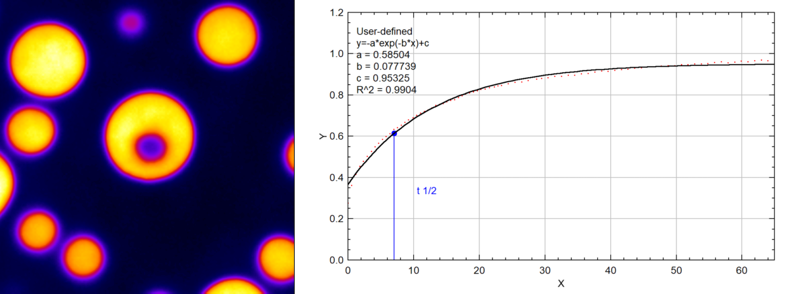

# RLB FRAP – ImageJ/Fiji Macro

*Version 1.0* – *MIT licence*

Quantitative analysis of **Fluorescence Recovery After Photobleaching (FRAP)** Designed for experiments acquired with **MetaMorph**.  ! Might request some adjustments for other image types !


---

## Table of Contents

1. [Overview](#overview)
2. [Prerequisites & Installation](#prerequisites--installation)
3. [Macro Structure & Default Parameters](#macro-structure--default-parameters)
4. [Step-by-Step Workflow](#step-by-step-workflow)
5. [Advanced Options](#advanced-options)
6. [Generated Output Files](#generated-output-files)
7. [Complete Example (Dataset Included)](#complete-example-dataset-included)
8. [Known Limitations & Best-Practice Tips](#known-limitations--best-practice-tips)
9. [Citation & Acknowledgements](#citation--acknowledgements)
10. [Contact](#contact)

---

## 1. Overview

`RLB_FRAP.ijm` is an ImageJ/Fiji macro that **quantifies fluorescence recovery after photobleaching (FRAP)** in time-series acquired with **MetaMorph**.

- It reads the exact time stamps of every frame via the Bio-Formats extensions, providing highly precise kinetic measurements.
- It offers several optional features: acquisition-bleaching correction, image registration (StackReg), manual ROI tracking.
---

## 2. Prerequisites & Installation

| Component | How to obtain / install |
|-----------|-------------------------|
| **Fiji (ImageJ)** | Download the full package from <https://fiji.sc/> |
| **Bio-Formats Macro Extensions** | Included with Fiji; update via *Help → Update…* if needed |
| **StackReg** (image-registration plugin) | *Plugins → Registration → StackReg* (optional, enabled through the macro) |


**Installation steps**

1. Copy `RLB_FRAP.ijm` into Fiji's `macros` folder.
2. Restart Fiji (or simply run the macro via *Plugins → Macros → Run…*).

---

## 3. Macro Structure & Default Parameters

| Variable | Default value | Meaning |
|----------|---------------|---------|
| `BE` | `6` | Frame number where the bleaching event occurs |
| `FD` | `11` | Diameter of the FRAP ROI (pixels) |
| `BRx`, `BRy` | `300`, `300` | Default centre coordinates of the ROI (used when the user knows the location) |
| `AskReg` | `0` | `1` → ask for image registration (StackReg); `0` → skip |
| `Live` | `1` | `1` → enable **Live-Replay** (to work on TIFF files); `0` → disable |
| `BG_Value` | `-1` | `-1` → background measured on each frame; any other value → fixed background to subtract |
| `Corr_Bleach` | `1` | `1` → apply acquisition-bleaching correction; `0` → skip |
| `Manual` | `0` | `1` → manual tracking of the bleached region (click on each frame); `0` → automatic ROI propagation |

> These defaults are chosen to make the macro ready-to-run for the most common experimental settings. They can be edited directly in the macro file before execution or changed through the dialogs that appear at runtime.

---

## 4. Step-by-Step Workflow

1. **Run the macro**

   `Plugins → Macros → Run… → RLB_FRAP.ijm`

2. **Define the FRAP ROI**

   *If `Manual = 0`*
   - A dialog asks **"Do you know the size and location of the bleaching region?"**
     - **Yes** – the ROI is placed at the default coordinates (`BRx`, `BRy`) with the size (`FD`). You can still edit the values in the dialog.
     - **No** – you must draw the ROI manually (oval or rectangle).

   *If `Manual = 1`* – the macro enters *manual tracking* mode; you must click the centre of the bleached region on each frame. The macro automatically advances to the next frame after each click.

3. **Choose ROI shape** – `oval` or `rectangle` (selected in the same dialog).

4. **Open the image file**
   - A file-open dialog appears.
   - **Supported formats**
     - **`.nd`** (MetaMorph) – *recommended* because it stores the exact `deltaT` for each plane.
     - **TIFF** generated by MetaMorph (used in Live-Replay mode).
   - *Note*: Other TIFF files may require minor adjustments; the macro is not guaranteed to work with other formats.

5. **Extract real time stamps**

   The macro uses `Ext.getPlaneTimingDeltaT` (Bio-Formats) to fill the `deltaT` array with the true acquisition times.

6. **Pre-processing**
   - Reset measurements (`Set Measurements… mean`).
   - Clear any existing ROIs, results tables, and the log window.

7. **Optional image registration** (`AskReg = 1`)
   - StackReg is launched to align the stack before intensity measurement.

8. **Intensity measurement**
   - Mean intensity inside the FRAP ROI, a background ROI, and the corrected FRAP signal (`frap_corr`).
   - Normalised signal (`frap_corr_norm`) is also computed.

9. **Acquisition-bleaching correction** (`Corr_Bleach`)
   - When enabled, the macro corrects for the gradual loss of fluorescence caused by the imaging process itself.

10. **Exponential fitting**
    - The UI lets you choose **Single exponential** or **Double exponential**.
    - Output parameters (for each method)
      - **τ½** (half-time) – both *infinity* (fit extrapolated to t → ∞) and *visible* (based on the last measured point).
      - **Mobile fraction** – both *infinity* and *visible*.
      - **R²** – goodness-of-fit.
      - **Bleaching efficiency** – % intensity loss at the bleaching frame.

11. **Fit quality evaluation**
    - `0.75 ≤ R² < 1.25` → *Good fitting* (message shown).
    - Otherwise → *Poor fitting* (warning shown).

12. **Saving results**
    - **Results table** → Excel (`.xls`) containing all measured and fitted values.
    - **Log** → plain-text (`_Log.txt`).
    - **Plots** → two PNG images:
      1. Corrected + normalised intensity vs. time.
      2. Recovery curve with the exponential fit overlaid.

13. **End of macro**
    - Temporary windows are closed; the working directory remains open with the saved files.

---

## 5. Advanced Options

| Option | Values | Description |
|--------|--------|-------------|
| **Live-Replay** (`Live`) | `1` = on, `0` = off | Works on TIFFs generated by MetaMorph. |
| **Image registration** (`AskReg`) | `1` = ask, `0` = skip | Calls **StackReg** (translation/rotation) to correct drift before intensity extraction. |
| **Fixed background** (`BG_Value`) | `-1` = measure per frame, any other number = constant background to subtract | Useful when the background is known a priori and does not change over time. |
| **Acquisition-bleaching correction** (`Corr_Bleach`) | `1` = apply, `0` = skip | Turn off if the acquisition bleaching is negligible or already corrected upstream. |
| **Manual tracking** (`Manual`) | `1` = manual, `0` = automatic | Enables frame-by-frame ROI repositioning by clicking the centre of the bleached region. |
| **Channel selection** | Allows to specifiy on which channel to perform the analysis (2 channel max.). |

---

## 6. Generated Output Files

| File | Extension | Content |
|------|-----------|---------|
| **Results table** | `.xls` (Excel) | All Data measured |
| **Log** | `.txt` | Full execution log, parameters used, warnings, R², etc. |
| **Intensity plot** | `.png` | Corrected + normalised intensity vs. time. |
| **Fit plot** | `.png` | Recovery curve with the exponential fit, annotated with τ½, mobile fraction, R², etc. |

**Naming convention** (example for a file called `myExperiment.nd`):

- `myExperiment.xls` (or `myExperiment_ChName.xls` if multiple channels were processed)
- `myExperiment_Log.txt` (or `myExperiment_ChName_Log.txt`)
- `myExperiment_intensity.png`
- `myExperiment_fit.png`

All files are saved in the same folder as the original image (`path\name…`).

---

## 7. Complete Example (Dataset Provided)

The repository contains a folder `Dataset` with a typical FRAP experiment (`p2_r11_m20.nd`).

```text
1. Start Fiji.
2. Plugins → Macros → Run… → RLB_FRAP.ijm
3. In the "FRAP ROI Properties" dialog set:
   • FRAP ROI height = 10
   • FRAP ROI width  = 10
   • FRAP ROI Position x = 290  
   • FRAP ROI Position y = 300
   • FRAP ROI Type = oval
4. Choose the file Dataset\p2_r11_m20.nd.
5. Answer "Yes" to "Do you know the size and location of the bleaching region?".
6. Select the fitting method – Double exponential.
7. Let the macro run.
8. When finished you will find in the same folder:
   - p2_r11_m20.xls
   - p2_r11_m20_Log.txt
   - p2_r11_m20_intensity.png
   - p2_r11_m20_fit.png
```

---

## 8. Known Limitations & Best-Practice Tips

| Limitation | Suggested workaround |
|------------|----------------------|
| **Only MetaMorph `.nd` and MetaMorph-generated TIFF are fully supported** | For other formats, ensure that the time stamps are stored in a way Bio-Formats can read them, or edit the macro to import a separate time vector. |
| **Very low signal** | The fit may become unstable. Increase exposure or acquire more frames after bleaching. |
| **Plateau not reached** (`PltReached < 95 %`) | The macro warns you. In this case rely on the *visible* parameters (`tau_visu`, `M_F_visu`). |
| **ROI drift not corrected** | Enable `AskReg = 1` (StackReg) or use `Manual = 1` to reposition the ROI manually. |


---

## 9. Citation & Acknowledgements

**Authors & acknowledgements**

- **Romain Le Bars** – design and development (romain.lebars@i2bc.paris-saclay.fr)
- **Christophe Klein** – methodological advice (christophe.klein@crc.jussieu.fr)
- **Sylvain Jeannin** – testing and validation (sylvain.jeannin@inserm.fr)

---

## 10. Contact

For questions:

```
Romain Le Bars
Imagerie-Gif, Institut for Integrative Biology of the Cell
romain.lebars@i2bc.paris-saclay.fr
```

---

## Licence

This project is distributed under the **MIT licence**. See the `LICENSE` file for details.
